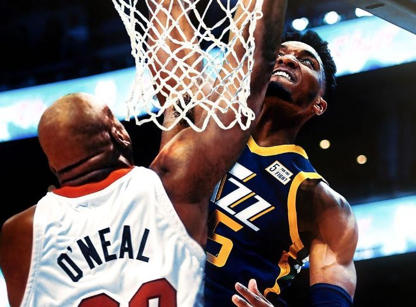
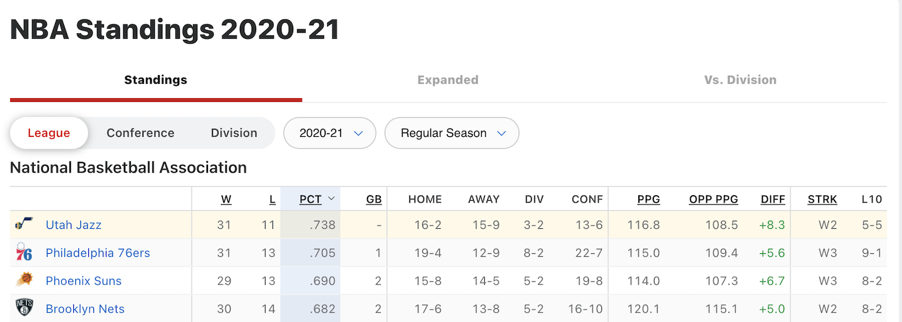

# Proving Shaq Wrong (or Right?) #

## Henry Crandall & Thomas Yassmin
emails: henry.crandall@gmail.com, u1218226@utah.edu
   
### Background and Motivation ### 

The Utah Jazz have had a sensational year so far, holding the best record in the NBA. Naturally, as a small market team lacking any Top 10 players, they have also been the subject of severe criticism in the media:
* Shaq's awkward convo with Donnovan Mitchell - [NBA on TNT post game interview between Shaw and Spida](https://www.youtube.com/watch?v=GFmk7kzDbiA)
* All star drama - [Lebron James trying to justify picking Jazz Stars last in All-Star Draft](https://www.youtube.com/watch?v=p6KicnmzhYg)
* Questionable 76er's officiating - [Rudy and Donny fined for comments](https://www.si.com/nba/jazz/news/mitchell-gobert-fined-for-public-criticism-of-officiating)
### Project Objectives ###
#### Primary Questions ####
The motivation for this project is to research if there is any statistical proof that
* 1) Donvoan Mitchell is on track to be a super star
* 2) the Utah Jazz are true title contenders
  
